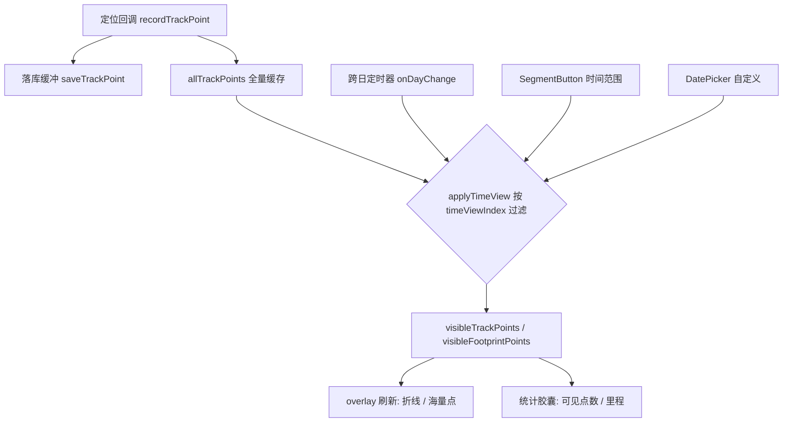

## 用户需求

在现有"地图足迹"功能基础上，新增按时间维度查看足迹的能力：将足迹按天组织，提供「总览 / 自定义查看时间 / 今日」三档时间视图切换，并在总览视图下只允许以"足迹点（海量点）"方式查看。

## 产品概述

应用持续记录轨迹点（已落库 footprint.db 的 track_points 表，含 timestamp 字段）。本次在"地图工具"面板新增"时间范围"切换控件，让用户能在不同时间区间内查看足迹：

- 今日：仅显示当天 0 点至今的记录（默认视图）。
- 自定义：通过两个日期选择器选定起止日期，查看该区间记录。
- 总览：显示全部历史记录，但强制以海量点（足迹点）呈现，禁用折线轨迹以避免跨天连线杂乱与卡顿。

页面默认展示"当前数据（今日）"，并在跨过午夜（日期变更）时自动刷新"今日"视图，将昨天的点从可见集剔除、只保留新一天记录的点并重绘。

## 核心功能

- 时间视图切换：总览 / 自定义 / 今日 三档，默认"今日"。
- 自定义时间：两个 DatePicker 选择起止日期，归一为当天 0:00 与 23:59:59。
- 总览限海量点：总览视图强制"海量点"展示，且"折线轨迹"按钮灰显禁用。
- 统计随视图变化：顶部队列胶囊（足迹点数、累计里程）显示当前可见视图的数据。
- 跨日自动刷新：应用内检测日期变更，若停留"今日"视图则自动重过滤并重绘。
- 数据仍单表存储：沿用 RelationalStore，按 timestamp 范围查询，不物理分库。

## 技术栈

- 平台：HarmonyOS NEXT（ArkTS + ArkUI），地图 @kit.MapKit，本地存储 @kit.ArkData（relationalStore.RdbStore）。
- 复用现有架构：单文件 entry/src/main/ets/pages/Index.ets；沿用 RdbStore、批量落库缓冲、覆盖物节流刷新、SegmentButton 等既有模式；不新增文件/模块，不影响已落地的"地图样式第四档"逻辑。

## 实现方案

### 1. 数据层（按范围查询，零新增存储成本）

- 新增 `queryTrackPointsByRange(startTs: number, endTs: number): Promise<TrackPointRecord[]>`：用 `relationalStore.RdbPredicates(TABLE_NAME).between('timestamp', startTs, endTs).orderByAsc('id')` 查询，命中已有 `idx_ts` 索引，返回含 timestamp/latitude/longitude/accuracy/speed 的完整记录。
- 改造 `loadTrackPoints()`：启动时以范围 `0 ~ Date.now()` 全量载入，写入新的内存"全量缓存" `allTrackPoints: TrackPointRecord[]`（按时间升序）。保留现有防漂移/里程累加逻辑用于初始化全量统计。

### 2. 内存模型（时间视图层 与 展示模式层 正交）

- 全量缓存 `allTrackPoints`（含 timestamp）作为唯一数据源；实时新点按时间顺序追加。
- 派生"当前可见集"：`visibleTrackPoints: mapCommon.LatLng[]`、`visibleFootprintPoints: mapCommon.LatLng[]`、`visibleTrackCount: number`、`visibleTotalDistance: number`。
- 新增 `@State timeViewIndex: number = 2`（0=总览 / 1=自定义 / 2=今日，默认今日）。
- 新增自定义起止 `@State customStartTs / customEndTs`。
- 核心方法 `applyTimeView()`：

1. 计算 `[startTs, endTs]`：今日=今天 0 点~now；自定义=用户选起止（归一 0:00~23:59:59.999）；总览=0~now。
2. 从 `allTrackPoints` 过滤出落在该区间的记录，重建 `visibleTrackPoints`。
3. 重置 `lastFootprintPoint`，按当前模式距离门槛重算 `visibleFootprintPoints`；按时间相邻点累加 `visibleTotalDistance`（区间边界自然断开，绝不把昨天末点与今天首点连起来）。
4. 若 `timeViewIndex===0`（总览）强制 `displayMode=1` 并禁用折线按钮。
5. 刷新覆盖物（基于可见集）与统计胶囊。

### 3. 实时记录与删除适配

- `recordTrackPoint()`：新点先追加进 `allTrackPoints`；仅当新点 timestamp 落在当前可见范围时，才加入 `visibleTrackPoints`/`visibleFootprintPoints` 并累加可见统计，再走既有 `refreshOverlayOptimized()`。落库逻辑（`saveTrackPoint` 缓冲批量写全表）不变。
- `confirmClearTrack()`：保持"删除全部"语义（清表 + 全清内存与可见集），不引入部分删除。

### 4. 跨日自动刷新

- 维护 `currentDayKey: string`（YYYY-MM-DD）。启动后用 `setInterval`（每分钟一次，轻量字符串比较）检测日期 key 是否变更。
- 变更触发 `onDayChange()`：重算今日范围；若当前为"今日"视图，则重新过滤可见集、重绘 overlay 与统计（午夜前后最多延迟 1 分钟，可接受）。实时新点（带新 timestamp）继续正常加入。

### 5. UI 入口（地图工具面板）

- 在 `buildMapToolSheetContent()` 现有"显示2"分段控件上方，新增一行：左标签"时间范围" + `SegmentButton`（总览/自定义/今日）。
- 选中"自定义"时，该行下方展开两个 `DatePicker`（开始日期、结束日期），选择后调用 `applyTimeView()`。
- "显示2"分段控件的"折线轨迹"按钮在总览视图下 `enabled(false)` 灰显。

### 6. 持久化（可选增强）

- 将 `timeViewIndex` 与自定义起止日期存入 Preferences，重启恢复；默认仍为"今日"。

## 实现注意

- 单文件改动（仅 Index.ets），blast radius 可控；不改动现有三档地图样式与"地图样式第四档"逻辑。
- 性能：范围查询命中 `idx_ts`；切换视图为 O(n) 内存过滤（n 为总点数），配合既有覆盖物节流刷新，无热路径瓶颈；跨日定时器每分钟一次字符串比较，开销可忽略。
- 总览数据量可能很大，强制海量点（不画折线）既符合需求也避免卡顿。
- 错误兜底：查询/重绘异常仅打日志，不阻塞定位与实时记录。

## 架构设计

时间视图层（决定"显示哪些点"）与展示模式层（决定"怎么画：折线/海量点"）正交叠加，覆盖物与统计均基于"可见集"：



## 目录结构

改动集中到单文件，沿用现有"样式常量 + SegmentButton + 覆盖物"架构，不新增文件。

```
entry/src/main/ets/pages/Index.ets   # [MODIFY]
  - 新增 queryTrackPointsByRange(startTs, endTs) 范围查询方法
  - 改造 loadTrackPoints()：载入全量带 timestamp 的 allTrackPoints 缓存
  - 新增 @State timeViewIndex / customStartTs / customEndTs 与 currentDayKey
  - 新增 applyTimeView() 与 onDayChange()：过滤可见集、重算统计、总览限海量点、跨日刷新
  - recordTrackPoint() / confirmClearTrack() 适配可见集
  - buildMapToolSheetContent()：新增"时间范围"分段控件 + 自定义 DatePicker 展开 + 总览禁用折线按钮
  - 统计胶囊 UI 改用可见集统计
```

## 关键代码结构

```typescript
// 时间视图类型：0=总览, 1=自定义, 2=今日
private timeRangeOf(view: number): { startTs: number; endTs: number } { /* ... */ }

// 按时间视图从全量缓存过滤出可见轨迹点并重建统计/覆盖物
private applyTimeView(): void { /* 过滤 allTrackPoints -> visible* ; 总览强制 displayMode=1 */ }

// 按 timestamp 范围查询（命中 idx_ts）
private async queryTrackPointsByRange(startTs: number, endTs: number): Promise<TrackPointRecord[]> { /* ... */ }
```

## 设计说明（基于 HarmonyOS ArkUI 声明式组件范式）

本次为"地图工具"半模态面板的增量改造，保持与现有面板一致的原生卡片风格，不引入新视觉语言。

### 面板改造布局（自上而下）

- **时间范围行（新增）**：左侧 `Text('时间范围')`（font_secondary，14fp），右侧 `SegmentButton`（胶囊式，三档：总览 / 自定义 / 今日），默认选中"今日"。分段控件沿用现有 `selectedBackgroundColor: $r('sys.color.ohos_id_color_activated')` 与 `fontColor: $r('sys.color.font_secondary')` 风格。
- **自定义日期行（条件展开）**：仅当时间范围选中"自定义"时出现，垂直排列两个 `DatePicker`（开始日期、结束日期），标签分别为"开始"与"结束"，选中后实时调用 applyTimeView 重绘。
- **显示模式行（既有"显示2"）**：保留"折线轨迹 / 海量点"分段控件；当时间范围为"总览"时，"折线轨迹"按钮 `enabled(false)` 灰显（font_fourth），仅"海量点"可选，直观表达"总览只能看足迹点"的约束。
- **统计胶囊（顶部地图浮层，既有）**：`足迹点 N · X 公里` 改为显示当前时间视图的可见统计，随视图切换实时变化。

### 交互与动效

- 分段控件选中态使用系统激活色高亮，切换有原生过渡。
- 自定义日期行展开/收起跟随 SegmentButton 选择，使用 ArkUI 条件渲染自然过渡。
- 总览下折线按钮灰显提供明确禁用反馈，避免误操作。

### 响应式与一致性

- 面板宽度沿用半模态 `SheetSize.MEDIUM/LARGE`，控件右对齐与现有行对齐；不破坏移动端单手操作与既有安全区布局。