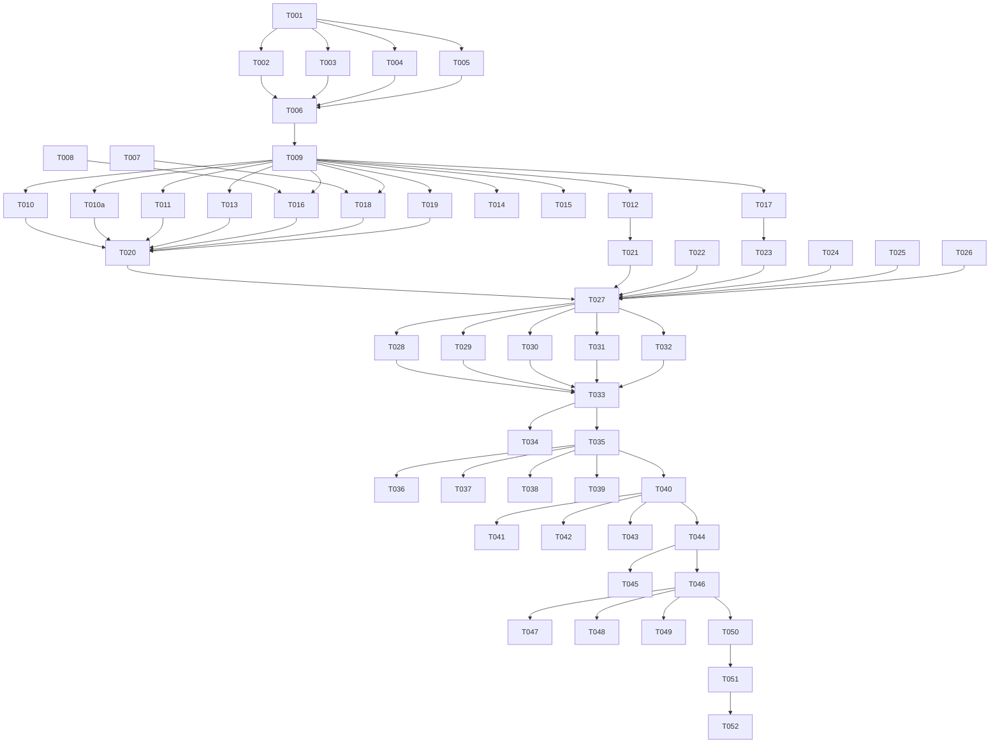

# Tasks: 地图轨迹应用架构重构

**Input**: Design documents from `spec/arch-refactor/`
**Prerequisites**: plan.md (required), spec.md (required for user stories)

**Tests**: 未显式要求，不生成测试任务

**Organization**: 任务按用户故事分组，每个故事可独立实施和验证

## Format: `[ID] [P?] [Story] Description`

- **[P]**: 可并行执行（不同文件，无依赖）
- **[Story]**: 所属用户故事（US1, US2, US3, US4, US5）
- 包含精确文件路径

## Phase 1: Setup (共享基础设施)

**Purpose**: 目录重组与基础文件迁移，为所有用户故事提供统一的目录结构

- [X] T001 创建新目录结构：service/、viewmodel/、common/、components/，在 entry/src/main/ets/ 下
- [X] T002 将 util/TrackUtils.ets 迁移到 common/TrackUtils.ets，更新所有导入路径
- [X] T003 [P] 将 location/TrackLocationService.ets 迁移到 service/TrackLocationService.ets，更新导入路径
- [X] T004 [P] 将 location/PermissionService.ets 迁移到 service/PermissionService.ets，更新导入路径
- [X] T005 [P] 将 map/MapOverlayManager.ets 迁移到 service/MapOverlayManager.ets，更新导入路径
- [X] T006 删除旧目录 location/、map/、util/（确认迁移完成后）
- [X] T007 将 MapStyleTest.ets 中的 JSON 字符串导出为 rawfile/map_style_test.json，在 entry/src/main/resources/rawfile/ 下
- [X] T008 创建 viewmodel/MapStyleViewModel.ets 骨架，在 entry/src/main/ets/viewmodel/ 下
- [X] T009 更新 Index.ets 中所有因目录迁移而变化的导入路径

---

## Phase 2: Foundational (阻塞性前置条件)

**Purpose**: 核心基础修复，必须在任何用户故事之前完成

**⚠️ 关键**: 此阶段未完成前不可开始任何用户故事

- [X] T010 统一 Haversine：删除 TrackLocationService.calculateCentroidDistance()，改调 common/TrackUtils.calculateDistance()，在 entry/src/main/ets/service/TrackLocationService.ets
- [X] T010a 统一 Haversine：删除 TimeViewModel.distanceBetween()，改调 common/TrackUtils.calculateDistance()，在 entry/src/main/ets/viewmodel/TimeViewModel.ets
- [X] T011 修正 TimeViewModel.applyTimeView() 的里程计算：将简化公式替换为 calculateDistance() 调用，在 entry/src/main/ets/viewmodel/TimeViewModel.ets
- [X] T012 [P] 修正 TrackUtils.computeStats() 的里程计算：将简化公式替换为 calculateDistance() 调用，在 entry/src/main/ets/common/TrackUtils.ets
- [X] T013 [P] 修复 TrackDatabase.queryByRange()：查询列从 [latitude, longitude, timestamp] 补全为 [latitude, longitude, timestamp, accuracy, speed]，字段值不再硬编码为 0，在 entry/src/main/ets/data/TrackDatabase.ets
- [X] T014 [P] 修复 TrackDatabase.flushBatch()：写入失败时不清空 pendingPoints 缓冲，在 entry/src/main/ets/data/TrackDatabase.ets
- [X] T015 [P] 修复 TrackLocationService.startLocation()：先调用 stopLocation() 注销旧监听再注册新监听，防止重复注册，在 entry/src/main/ets/service/TrackLocationService.ets
- [X] T016 实现 MapStyleViewModel：包含 setContext/saveMapStyle/loadMapStyle，将 Index 的 saveMapStyle/loadMapStyle 逻辑迁入，在 entry/src/main/ets/viewmodel/MapStyleViewModel.ets
- [X] T017 重构 TimeViewModel 去除 UI 调用：删除 openCustomDatePicker()，onTimeViewSelected() 返回 boolean（true=需要日期选择），新增 setCustomRange(start, end)，在 entry/src/main/ets/viewmodel/TimeViewModel.ets
- [X] T018 重构 MapOverlayManager.applyMapStyle(index=3)：从 rawfile/map_style_test.json 同步读取 JSON 字符串替代导入 MapStyleTest，删除对 pages/MapStyleTest 的导入，在 entry/src/main/ets/service/MapOverlayManager.ets
- [X] T019 清理 Index.ets 冗余状态：删除 trajectorySegmentOptions、demoSelectedIndex、selectedIndexes 三个未使用的 @State 变量及 display2SegmentOptions 冗余定义，在 entry/src/main/ets/pages/Index.ets

**Checkpoint**: 基础修复完成 — Haversine 统一、DB 补全、偏好统一、ViewModel 去 UI、JSON 外置

---

## Phase 3: User Story 1 - 拆分 Index 巨石组件 (Priority: P1) 🎯 MVP

**Goal**: 将 Index.ets 从 1210 行拆分为编排层 + 3 个独立 Tab 组件，Index ≤ 300 行

**Independent Test**: 3 个 Tab 页正常切换，地图/轨迹/统计/我的全部功能与拆分前一致

### Implementation for User Story 1

- [X] T020 [US1] 创建 FootprintTab.ets 骨架：提取 Index 中足迹地图 Tab 的全部 UI（MapComponent + 左上统计胶囊 + 右上时间切换 + 右下工具胶囊 + 地图工具半模态面板）和交互逻辑（onMapReady/onMapClick/onLocationSample/recordTrackPoint/shouldRecordFootprint/refreshVisibleView/switchDisplayMode/switchMapStyle/switchMode/applyNightMode/clearTrack/confirmClearTrack/onTimeViewSelected/onDayChange/permissionFlow/enableMyLocation/refreshPermissionState），在 entry/src/main/ets/pages/FootprintTab.ets
- [X] T021 [US1] 创建 StatsTab.ets 骨架：提取 Index 中统计 Tab 的全部 UI（buildStatsPage 完整内容）和数据刷新逻辑（computeStats），在 entry/src/main/ets/pages/StatsTab.ets
- [X] T022 [US1] 重构 Index.ets 为编排层：仅持有 5 个服务实例（db/permSvc/locationSvc/mapManager/timeModel）+ mapStyleVM，aboutToAppear/aboutToDisappear/onPageShow/onPageHide 生命周期管理，HdsTabs 编排（3 个 TabContent 分别引用 FootprintTab/StatsTab/MineTab），状态栏/导航条高度获取与传递，各 @Link 状态声明与初始化，在 entry/src/main/ets/pages/Index.ets
- [X] T023 [US1] 在 FootprintTab 中实现时间视图切换的日期选择：替代 TimeViewModel.openCustomDatePicker()，FootprintTab.onTimeViewSelected() 判断 timeModel 返回值需要日期选择时自行弹出 DatePickerDialog，选择结果回传 timeModel.setCustomRange()，在 entry/src/main/ets/pages/FootprintTab.ets
- [X] T024 [US1] 在 FootprintTab 中实现地图样式切换：替代 Index 的 saveMapStyle/loadMapStyle，改用 mapStyleVM，在 entry/src/main/ets/pages/FootprintTab.ets
- [X] T025 [US1] 在 FootprintTab 中实现权限流程与我的位置开启：从 Index.permissionFlow/enableMyLocation 迁入，在 entry/src/main/ets/pages/FootprintTab.ets
- [X] T026 [US1] 在 StatsTab 中实现统计计算：onPageShow 时调用 computeStatsUtil(timeModel.allPoints) 刷新统计 @State，在 entry/src/main/ets/pages/StatsTab.ets
- [X] T027 [US1] 验证拆分后 Index.ets 行数 ≤ 300 行，各 Tab 功能完整

**Checkpoint**: Index 拆分完成，3 个 Tab 页独立运行，功能与拆分前等价

---

## Phase 4: User Story 2 - 瘦身 Mine 组件与拆分面板 (Priority: P2)

**Goal**: Mine.ets 从 1223 行瘦身至 ≤200 行，移除占位代码，4 个面板拆为子组件

**Independent Test**: 我的 Tab 功能完整，无空壳/占位项，面板正常弹出交互

### Implementation for User Story 2

- [X] T028 [P] [US2] 创建 CardItem.ets：从 Mine 内部提取通用列表项组件（左图标+文字+右箭头），在 entry/src/main/ets/components/CardItem.ets
- [X] T029 [P] [US2] 创建 RecordModePanel.ets：提取 Mine.buildRecordModeSheet() 面板内容为独立 @Builder 子组件，在 entry/src/main/ets/components/RecordModePanel.ets
- [X] T030 [P] [US2] 创建 LocationPermPanel.ets：提取 Mine.buildLocationSheet() 面板内容为独立 @Builder 子组件，在 entry/src/main/ets/components/LocationPermPanel.ets
- [X] T031 [P] [US2] 创建 SettingPanel.ets：提取 Mine.buildSettingSheet() + privacyRootContent() 面板内容为独立 @Builder 子组件，移除占位项（字体大小、页面跳转、Web页面、关于我们、检测版本），修复隐私设置 Toggle 硬编码 isOn:true 问题，在 entry/src/main/ets/components/SettingPanel.ets
- [X] T032 [P] [US2] 创建 StrategyLabPanel.ets：提取 Mine.buildStrategyLabSheet() 面板内容为独立 @Builder 子组件，在 entry/src/main/ets/components/StrategyLabPanel.ets
- [X] T033 [US2] 重构 Mine.ets：移除全部占位代码（customSwitchOn/customSelectIndex/pushSwitchOn 及对应 UI 项：字体大小/页面跳转/Web页面/关于我们/检测版本/我的订单/意见反馈/退出登录），4 个面板改为调用子组件 @Builder，接口从 9@Link+7回调 精简为 7@Link+3回调（删除 pushSwitchOn/customSwitchOn/customSelectIndex 三个 @Link，合并 onRequestPermissions/onOpenPermissionSettings/onRequestBackgroundPermission 为 onRefreshPermission），在 entry/src/main/ets/pages/Mine.ets
- [X] T034 [US2] 同步更新 Index.ets：删除 pushSwitchOn/customSwitchOn/customSelectIndex 三个 @State 变量及传递给 Mine 的对应 @Link，在 entry/src/main/ets/pages/Index.ets
- [X] T035 [US2] 验证 Mine.ets 行数 ≤ 200 行，我的 Tab 功能完整无占位项

**Checkpoint**: Mine 瘦身完成，面板拆为子组件，占位代码清零

---

## Phase 5: User Story 3 - 统一基础设施 (Priority: P2)

**Goal**: Haversine 单一实现、里程计算一致、DB 查询完整、偏好统一管理

**Independent Test**: 距离计算仅 1 处实现；统计里程与实时里程一致；DB 历史数据 accuracy/speed 非零；地图样式偏好由 MapStyleVM 管理

### Implementation for User Story 3

- [X] T036 [US3] 验证 Haversine 统一：确认 common/TrackUtils.calculateDistance() 为唯一实现，TrackLocationService 和 TimeViewModel 均调用它
- [X] T037 [US3] 验证里程计算一致：确认 applyTimeView() 和 computeStats() 均使用 calculateDistance()
- [X] T038 [US3] 验证 DB 查询补全：确认 queryByRange() 返回完整 accuracy/speed 值
- [X] T039 [US3] 验证偏好统一：确认 Index 不再直接调用 preferences API（地图样式由 MapStyleViewModel 管理）
- [X] T040 [US3] 删除 pages/MapStyleTest.ets 文件（JSON 已外置到 rawfile，导入已移除）

**Checkpoint**: 基础设施统一完成，无重复实现，数据完整

---

## Phase 6: User Story 4 - 修复职责越界与潜在 Bug (Priority: P3)

**Goal**: TimeViewModel 无 UI 调用；定位服务不重复注册；DB 失败保缓冲；初始化时序正确

**Independent Test**: TimeViewModel 无 UI 导入；重复调用 startLocation 无泄漏；flushBatch 失败缓冲保留；首帧 padding 正确

### Implementation for User Story 4

- [X] T041 [US4] 验证 TimeViewModel 无 UI 调用：确认无 DatePickerDialog/AlertDialog 等导入，onTimeViewSelected 返回 boolean
- [X] T042 [US4] 优化初始化时序：将地图 MapComponent 的创建延迟到窗口尺寸获取完成之后（或在窗口回调后再设置 padding），确保首帧 padding 非零，在 entry/src/main/ets/pages/FootprintTab.ets
- [X] T043 [US4] 验证定位服务防重复注册：确认 startLocation() 先调用 stopLocation()
- [X] T044 [US4] 验证 DB 失败保缓冲：确认 flushBatch() catch 分支不清空 pendingPoints

**Checkpoint**: 职责越界修复完成，潜在 Bug 修复完成

---

## Phase 7: User Story 5 - MapStyle JSON 外置与冗余清理 (Priority: P3)

**Goal**: MapStyle JSON 在 rawfile 中；Index 无冗余 @State

**Independent Test**: 「测试」样式正常应用；无未使用的 @State

### Implementation for User Story 5

- [X] T045 [US5] 验证 MapStyle JSON 外置：确认 rawfile/map_style_test.json 存在且 MapOverlayManager 从中读取
- [X] T046 [US5] 验证冗余清理：确认 Index 无 trajectorySegmentOptions/demoSelectedIndex/selectedIndexes 等未使用 @State

**Checkpoint**: JSON 外置与冗余清理完成

---

## Phase 8: Polish & Cross-Cutting Concerns

**Purpose**: 跨故事的收尾优化

- [X] T047 [P] 删除 pages/MapStyleTest.ets（如尚未删除）
- [X] T048 更新 model/TrackTypes.ets 中的 TAG 常量注释，确认各模块使用各自的 TAG
- [X] T049 全量检查导入路径：确认所有 .ets 文件的 import 路径与迁移后的目录结构一致（service/ 替代 location/ + map/，common/ 替代 util/）
- [X] T050 最终代码行数验证：Index ≤ 300行，Mine ≤ 200行，FootprintTab ≤ 400行

---

## Phase 9: Verification

<!-- verification_scope: build-only -->

**Purpose**: 构建并部署验证

- [x] T051 构建项目并修复编译错误（调用 build_project；迭代修复→构建直到成功）
- [x] T052 部署应用到设备/模拟器（调用 start_app）

---

## 📊 Dependency Graph

## ⚡ Parallel Execution Guide

| Phase | Tasks | Required Files | Execution Notes |
|---|---|---|---|
| Setup | T003, T004, T005 | location/→service/ 迁移 | 三个迁移可并行 |
| Setup | T002, T003-T005 | util/→common/, location/→service/ | 迁移可并行但 T006 需等全部完成 |
| Foundational | T010-T012 | TrackLocationService, TimeViewModel, TrackUtils | Haversine 统一可并行 |
| Foundational | T013, T014 | TrackDatabase | DB 修复可并行 |
| Foundational | T015, T016, T017, T018 | 各自独立文件 | 四个修复可并行 |
| US2 | T028-T032 | components/ 下 5 个新文件 | 面板拆分可并行 |
| US3-US5 | T036-T046 | 验证为主 | 大部分可并行 |

## 实施策略

### MVP（仅 User Story 1）

1. 完成 Phase 1: Setup
2. 完成 Phase 2: Foundational
3. 完成 Phase 3: US1（Index 拆分）
4. **停下来验证**：构建并运行，确认功能等价
5. 可部署演示

### 增量交付

1. Setup + Foundational → 基础就绪
2. US1 → Index 拆分验证 → 部署
3. US2 → Mine 瘦身验证 → 部署
4. US3 → 基础设施统一验证 → 部署
5. US4 → Bug 修复验证 → 部署
6. US5 → 清理验证 → 部署

---

## Summary Report

- **Total tasks**: 52
- **Per story count**: US1=8, US2=8, US3=5, US4=4, US5=2, Setup=9, Foundational=10, Polish=4, Verification=2
- **Parallel opportunities**: Setup 3 个迁移可并行；Foundational 多个独立修复可并行；US2 的 5 个面板子组件可并行
- **Independent test criteria**: 每个 US 有明确验证条件（行数上限 + 功能等价）
- **MVP scope**: Phase 1 + Phase 2 + Phase 3 (US1)
